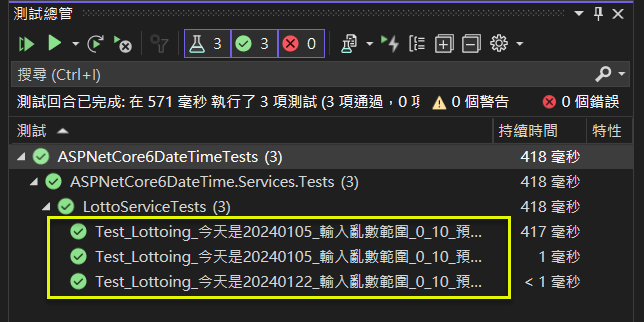

## 靜態元素 (Static Elements) 的單元測試, 以 DateTime.Now 為例
Unit Test for Static Elements (DateTime.Now) in ASP.NET Core 6 MVC   

## 前言

接續前一篇 <a href="https://www.jasperstudy.com/2024/01/non-deterministic-elements-random.html" target="_blank">樂透開獎</a> 的例子, 假設有一個新的需求: "樂透開奬不是每天開, 而是固定每個月的 5 日才會開獎".    

因此, 程式要加一個當前日期時間的判斷.  
* 若為 5 日才可開獎, 並回傳開獎的結果.  
* 若為其它日期, 就不可開獎, 並回傳警告訊息.  
這個邏輯要如何測試呢? 總不能等到每個月 5 日, 或者調整筆電的系統時間, 才來測試吧.  

以下係採 參考文件2.. "An interface that wraps the DateTime.Now" 方式進行演練及實作.  

<a href="https://github.com/jasper-lai/20240122_ASPNetCore6DateTime" target="_blank">完整範例可由 GitHub 下載.</a>

<!--more-->

## 演練細節

### 步驟_1: 加入 IDateTimeProvider 介面 及 DateTimeProvider 類別

```csharp
public interface IDateTimeProvider
{
    DateTime GetCurrentTime();
}

public class DateTimeProvider : IDateTimeProvider
{
    public DateTime GetCurrentTime()
    {
        return DateTime.Now;
    }
}
```

### 步驟_2: 將 IDateTimeProvider 註冊至 DI container
```csharp
#region 註冊相關的服務
builder.Services.AddSingleton<IRandomGenerator, RandomGenerator>();
builder.Services.AddScoped<ILottoService, LottoService>();
builder.Services.AddSingleton<IDateTimeProvider, DateTimeProvider>();
#endregion
```

### 步驟_3: 修改 LottoService 的處理邏輯

1.. 修改建構子, 加入 IDateTimeProvider 物件的注入.  

```csharp
private readonly IRandomGenerator _randomGenerator;
private readonly IDateTimeProvider _dateTimeProvider;

public LottoService(IRandomGenerator randomGenerator, IDateTimeProvider dateTimeProvider) 
{
    _randomGenerator = randomGenerator;
    _dateTimeProvider = dateTimeProvider;
}
```

2.. 修改 Lottoing() 方法, 加入是否為每個月 5 日的判斷.  
```csharp
public LottoViewModel Lottoing(int min, int max)
{

    var result = new LottoViewModel();
    var now = _dateTimeProvider.GetCurrentTime();

    if (now.Day != 5)
    {
        result.YourNumber = -1;
        result.Message = "非每個月5日, 不開獎";
        return result;
    }

    // Random(min, max): 含下界, 不含上界
    var yourNumber = _randomGenerator.Next(min, max);
    // 只要餘數是 9, 就代表中獎
    var message = (yourNumber % 10 == 9) ? "恭喜中獎" : "再接再厲";

    result.YourNumber = yourNumber;
    result.Message = message;

    return result;
}
```

### 步驟_4: 修改原有的測試案例

1.. 因為 LottoService 的建構子增加了 IDataTimeProvider 這個參數, 所以, 原有的測試案例, 也要跟著改, 不然會編譯失敗.  

```csharp
[TestMethod()]
public void Test_Lottoing_今天是20240105_輸入亂數範圍_0_10_預期回傳_9_恭喜中獎()
{
    // Arrange
    var expected = new LottoViewModel()
    { YourNumber = 9, Message = "恭喜中獎" }
                .ToExpectedObject();

    int fixedValue = 9;
    DateTime today = new(2024, 01, 05);
    var mockRandomGenerator = new Mock<IRandomGenerator>();
    var mockDateTimeProvider = new Mock<IDateTimeProvider>();
    mockRandomGenerator.Setup(r => r.Next(It.IsAny<int>(), It.IsAny<int>())).Returns(fixedValue);
    mockDateTimeProvider.Setup(d => d.GetCurrentTime()).Returns(today);

    // Act
    var target = new LottoService(mockRandomGenerator.Object, mockDateTimeProvider.Object);
    var actual = target.Lottoing(0, 10);

    // Assert
    expected.ShouldEqual(actual);
}
```

```csharp
[TestMethod()]
public void Test_Lottoing_今天是20240105_輸入亂數範圍_0_10_預期回傳_1_再接再厲()
{
    // Arrange
    var expected = new LottoViewModel()
    { YourNumber = 1, Message = "再接再厲" }
                .ToExpectedObject();

    int fixedValue = 1;
    DateTime today = new(2024, 01, 05);
    var mockRandomGenerator = new Mock<IRandomGenerator>();
    var mockDateTimeProvider = new Mock<IDateTimeProvider>();
    mockRandomGenerator.Setup(r => r.Next(It.IsAny<int>(), It.IsAny<int>())).Returns(fixedValue);
    mockDateTimeProvider.Setup(d => d.GetCurrentTime()).Returns(today);

    // Act
    var target = new LottoService(mockRandomGenerator.Object, mockDateTimeProvider.Object);
    var actual = target.Lottoing(0, 10);

    // Assert
    expected.ShouldEqual(actual);
}
```

### 步驟_5: 針對不開獎的日期, 建立測試案例

```csharp
[TestMethod()]
public void Test_Lottoing_今天是20240122_輸入亂數範圍_0_10_預期回傳_負1_非每個月5日_不開獎()
{
    // Arrange
    var expected = new LottoViewModel()
    { YourNumber = -1, Message = "非每個月5日, 不開獎" }
                .ToExpectedObject();

    int fixedValue = 9;
    DateTime today = new(2024, 01, 22);
    var mockRandomGenerator = new Mock<IRandomGenerator>();
    var mockDateTimeProvider = new Mock<IDateTimeProvider>();
    mockRandomGenerator.Setup(r => r.Next(It.IsAny<int>(), It.IsAny<int>())).Returns(fixedValue);
    mockDateTimeProvider.Setup(d => d.GetCurrentTime()).Returns(today);

    // Act
    var target = new LottoService(mockRandomGenerator.Object, mockDateTimeProvider.Object);
    var actual = target.Lottoing(0, 10);

    // Assert
    expected.ShouldEqual(actual);
}
```

### 步驟_6: 檢查測試的結果

  


## 結論

DateTime 為 struct, DateTime.Now 為 static property, 在需要依當前日期時間作判斷的狀況下, 若直接呼叫 DateTime.Now, 將導致相依於 DateTime, 無法快速進行程式邏輯的測試.  
故需以一個 interface 進行打包 (Wrap), 讓外界得以操作物件實體, 及其回傳值.  

只是, 如同前一篇亂數範例所述的, 也會造成開發人員要習慣使用打包後的介面及類別, 這是比較美中不足的地方.  

或許有更好的處理方式, 只是受限筆者的能力, 無法作到盡善盡美, 但至少可以供參考.  


## 參考文件

* <a href="https://columns.chicken-house.net/2022/05/29/datetime-mock/" target="_blank">1.. (安德魯的部落格) [架構師的修練] - 從 DateTime 的 Mock 技巧談 PoC 的應用</a>  
* <a href="https://methodpoet.com/unit-testing-datetime-now/" target="_blank">2.. 4 Golden Strategies for Unit Testing DateTime.Now in C#</a>  
> The most popular strategies for unit testing DateTime.Now in C# are:  
> * An interface that wraps the DateTime.Now  
> * SystemTime static class  
> * Ambient context approach  
> * DateTime property on a class  

* <a href="https://learn.microsoft.com/en-us/dotnet/api/system.datetime?view=net-6.0" target="_blank">3.. (Microsoft Learn) DateTime Struct</a>  
* <a href="https://learn.microsoft.com/en-us/dotnet/api/system.datetime.today?view=net-6.0" target="_blank">4.. (Microsoft Learn) DateTime.Today Property</a>  
* <a href="https://learn.microsoft.com/en-us/dotnet/api/system.datetime.now?view=net-6.0" target="_blank">5.. (Microsoft Learn) DateTime.Now Property</a>  


